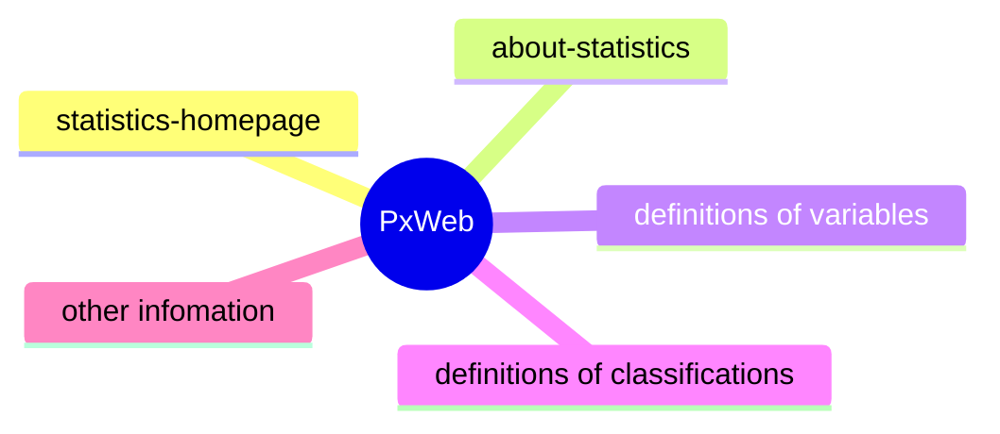

# Links from Px to external metadata
Some metadata for a table will exist externaly, e.g. definitions in a classification database, and PxWebApi needs to provide links to these resources.




Information for a link includes:
```
href:  an url e.g. "https://www.ssb.no/en/aku" , pointing to a resource
type: the mime type of the resource (typically "text/html", but could also be e.g. markdown) 
label: text describing the resouce, like "Statistics homepage". 
relation: some description of how the resource is related to the table , like "statistics-homepage". 
```

In the datasource of the api, the external metadata may be  attached to tables, variables and values.
This is done by using a META-ID keyword which is an urn e.g. "statistics:aku". The api then transforms it to href,type,label and relation according to rules
given in  a config file. 
 

## META-ID
In the datasource you can attach a META-ID to a table, variable or value. The purpose of the META-ID is to identify a definition in an external metadata system. 
In a Px-file , it may look like:
```
META-ID(“my_variable”)=”METASYS1:region”;
```
(For more information about the META-ID keyword, see the PX-file format documentation.)

The META-ID identifies which metadata system the definition resides in and also holds the arguments to navigate to the specific definition within that metadata system.
The META-ID can also hold information about more than one metadata system if definitions exist in multiple metadata system.
```
META-ID(“my_variable”)=”METASYS1:arg1:arg2,METASYS2:arg1:arg2”;
```

When pxwebapi finds META-ID fields it uses information from a config files to create links.
## Metaid.config
If links to metdata systems shall be enabled the file metaid.config is assumed to exist in the root directory of the application. 
In metadid.config you define the URL signatures to your metadata system(s). 
The URL signatures are divided into three sections in the metaid.config file for attachments at tables, variables and values. The sections are be named:
* onTable
* onVariable
* onValue

The sections are strucktured in the same way, each contain a list of Metadata systems.
Each Metadata system has an ID and list of URL signatures grouped by what they contain or how they relate to the table and their content-type. 
Each URL signature contains information about:
* Language
* Label (text) format
* URL format

The URL format shall contain placeholders {0}, {1} … {n} where the arguments in the META-ID will be inserted. 
The label format may contain placeholders depending on the attachment level, for values {0} will be replaces by the name of the variable and {1}   by the name of the value.
For variables its just {0} for the name of the variable. For label formats in the onTable section there are no placeholdes.

For example this fragment of the config file:
```
<?xml version="1.0"?>
<metaId>
  <onTable>
    <metaSystem id="STATISTICS">
      <relationalGroup relation="statistics-homepage" type="text/html">
        <link pxLang="no" labelStringFormat="Statistikkens hjemmeside" urlStringFormat="https://www.ssb.no/{0}" />
        <link pxLang="en" labelStringFormat="Statistics homepage" urlStringFormat="https://www.ssb.no/en/{0}" />
      </relationalGroup>
     ... 
 
```

When the api finds this META-ID "STATISTICS:aku", on table level, it creates
```
"relation": "statistics-homepage"
"href": "https://www.ssb.no/en/aku"
"label": "Statistics homepage"
"type": "text/html"
```
for an english request.

This is done by looping all metasystems for the attachment level and see if the META-ID starts with the id of the metasystem. If so, output is produced.
The rest of the META-ID after the id of the metasystem is considered to be arguments.
This matching mechanism allows for colons in the ids of the metasystems. 

Here is a full metaid.config:
```
<?xml version="1.0"?>
<metaId>
  <onTable>
    <metaSystem id="STATISTICS">
      <relationalGroup relation="statistics-homepage" type="text/html">
        <link pxLang="no" labelStringFormat="Statistikkens hjemmeside" urlStringFormat="https://www.ssb.no/{0}" />
        <link pxLang="en" labelStringFormat="Statistics homepage" urlStringFormat="https://www.ssb.no/en/{0}" />
      </relationalGroup>
      <relationalGroup relation="about-statistics" type="text/html">
         <link pxLang="no" labelStringFormat="Om statistikken" urlStringFormat="https://www.ssb.no/{0}#om-statistikken" />
         <link pxLang="en" labelStringFormat="About the statistics" urlStringFormat="https://www.ssb.no/en/{0}#om-statistikken" />
      </relationalGroup>
    </metaSystem> 
  </onTable>
  <onVariable>
    <metaSystem id="urn:ssb:classification:klass">
       <relationalGroup relation="definition-classification" type="text/html">   
         <link pxLang="no" labelStringFormat="Klassifikasjon for {0}." urlStringFormat="https://www.ssb.no/klass/klassifikasjoner/{0}" />
         <link pxLang="en" labelStringFormat="Classification for {0}." urlStringFormat="https://www.ssb.no/en/klass/klassifikasjoner/{0}" />
       </relationalGroup>  
    </metaSystem>
    <metaSystem id="urn:ssb:conceptvariable:vardok">
      <relationalGroup relation="definition-classification" type="text/html">   
         <link pxLang="no" labelStringFormat="Definisjon av {0}." urlStringFormat="https://www.ssb.no/a/metadata/conceptvariable/vardok/{0}/nb" />
         <link pxLang="en" labelStringFormat="Definition of {0}." urlStringFormat="https://www.ssb.no/a/metadata/conceptvariable/vardok/{0}/en" />
      </relationalGroup>
    </metaSystem>
  </onVariable>
  <onValue>
    <metaSystem id="urn:ssb:conceptvariable:vardok">
      <relationalGroup relation="definition-value" type="text/html">
        <link pxLang="no" labelStringFormat="Definisjon av {1} for vaiabel {0}." urlStringFormat="https://www.ssb.no/a/metadata/conceptvariable/vardok/{0}/nb" />
        <link pxLang="en" labelStringFormat="Definition of {1} for vaiable {0}." urlStringFormat="https://www.ssb.no/a/metadata/conceptvariable/vardok/{0}/en" />
      </relationalGroup>
    </metaSystem>
    <metaSystem id="urn:ssb:contextvariable:common">
      <relationalGroup relation="definition-value" type="text/html">
        <link pxLang="no" labelStringFormat="Definisjon av {1} (Kostra)." urlStringFormat="https://www.ssb.no/kompis/statbank/?id={0}&amp;ver={1}&amp;val={2}" />
        <link pxLang="en" labelStringFormat="Definition of {1} (Kostra)." urlStringFormat="https://www.ssb.no/kompis/statbank/?id={0}&amp;ver={1}&amp;val={2}" />
      </relationalGroup>  
    </metaSystem>
  </onValue>
</metaId>

``` 
Note: 
* The metaSystem STATISTICS creates 2 links per language. 
* The last metaSystem on value does not use the name of the variable, only the name of the value.

## In the gui
The usecase is to provide content in pxweb2gui for the areas shown in Figma_infomation_defs.png

  


Figma_infomation_defs.png: 
  to get content for "area-1" , links with relation="statistics-homepage" on root is used
  to get content for "area-2" , links with relation="about-statistics" on root
  to get content for "area-3" , loop variables and look for relations starting with "definition-"
  
  
